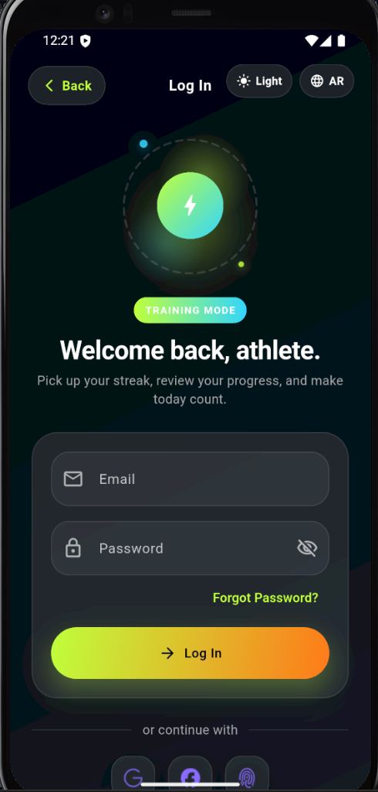
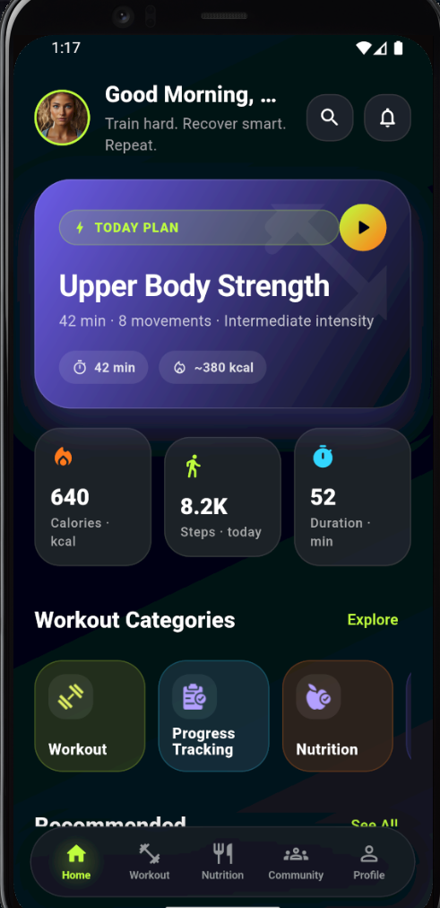
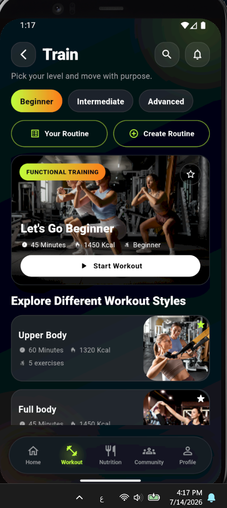
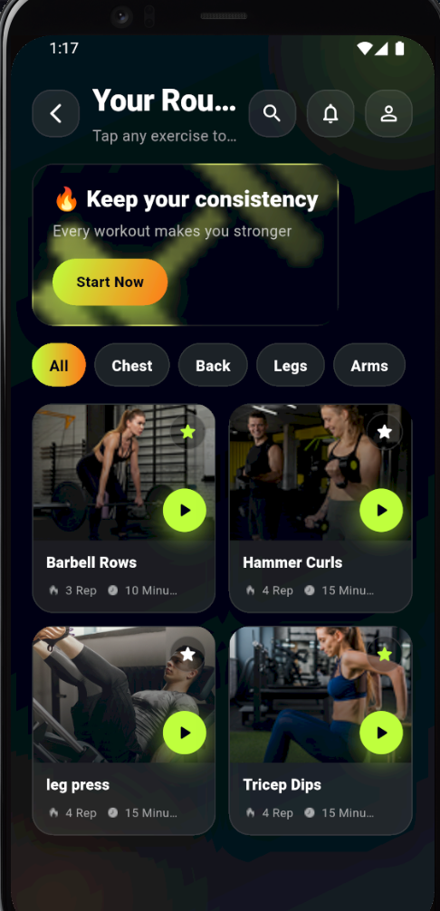
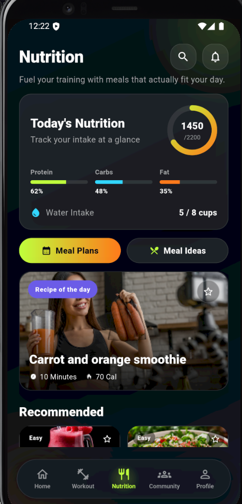
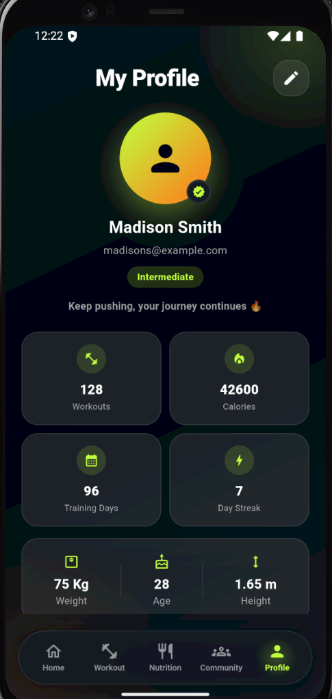
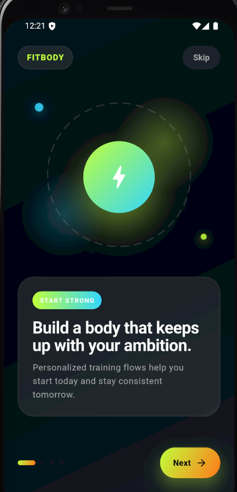

# 🏋️ FitBody — Premium Workout & Health Platform

A modern fitness application built with Flutter that helps users manage workouts, create custom routines, track progress, and stay motivated on their fitness journey — wrapped in a premium, glassmorphic dark/light design system inspired by apps like Apple Fitness+ and Nike Training Club.

<p align="left">
  
  
  
  
</p>

---

## 📱 Project Preview

> Save the corresponding screenshot into `docs/screenshots/` under each filename below (create the folder if it doesn't exist yet).

<p align="center">
  
  
  
  
</p>
<p align="center">
  
  
  
</p>

<p align="center">
  
</p>

---

## 🆕 Recent Redesign Highlights

The entire first-run and core experience recently went through a full premium UI/UX pass — not a visual tweak, but a from-scratch redesign of every screen listed below, built on a cohesive design system rather than one-off styling per page.

- **Splash, Welcome & Onboarding** — rebuilt as fully vector/abstract experiences (gradient medallions, dashed orbit rings, ambient glow orbs) instead of stock photography, so the very first impression is 100% on-brand instead of a generic gym photo.
- **Authentication flow** (Login, Sign Up, Forgot Password, Reset Password, Biometric) — new shared `AuthSectionHero`, `PremiumTextField`/`PremiumPasswordField` with animated focus states, a live `PasswordStrengthMeter`, and glass-card panels, all reusing the splash/onboarding visual language.
- **Nutrition module** — a new "Today's Nutrition" summary card (calorie ring + protein/carbs/fat meters + water intake), premium recipe cards with macro/rating/difficulty chips, a fully rebuilt Recipe Details screen (nutrition facts, steps, tips, benefits, similar recipes), and a restyled meal-plan wizard.
- **Recommended Workout screen** — an immersive `WorkoutHeroCard` with a "Start Workout" CTA, a `PopularWorkoutCard` grid with difficulty badges and gradient play buttons, and a header that no longer truncates its title.
- **Generated avatars** — every `CircleAvatar` that reused the same stock photo of a person (Profile, Home greeting, Workout Logs, Community) now renders a `UserAvatar` — a gradient-and-icon avatar generated from the app's own theme, so it no longer misrepresents different users/posts as the same person.
- **Cleanup** — removed the unwired, non-functional "Fill Your Profile" step from onboarding (it duplicated Sign Up fields and never persisted anything).

All of this kept the existing architecture, navigation, and business logic untouched — only presentation and reusable-widget layers changed.

---

## ✨ Features

### 🔐 Authentication

- Premium login & register flow with animated, validated form fields
- Forgot password → reset password flow
- Optional biometric (fingerprint) enable step
- Onboarding & guided setup
- Profile management

### 🏋️ Workout

- Browse workouts by category
- Immersive "Recommended Workout" hero screen with a curated popular-workouts grid
- Detailed exercise screens (muscle group, difficulty, duration, equipment)
- Create fully custom routines (name, goal, difficulty, weekly schedule)
- Drag-and-reorder exercise picker with editable sets/reps
- Category filtering & favorites

### 🥗 Nutrition

- Daily nutrition summary: calorie ring, protein/carbs/fat progress, water intake
- Recipe cards with macros, difficulty, and rating at a glance
- Full recipe details: nutrition facts, ingredients, cooking steps, chef's tips, health benefits, similar recipes
- Guided meal-plan wizard: dietary preferences → goals → generating → daily plan

### 📊 Fitness

- Progress tracking & workout logs
- Calorie & duration estimates
- Personal workout statistics (workouts completed, streak, training days)
- Personalized routine summaries

### 🎨 User Experience

- Full Dark Mode & Light Mode support
- Fully responsive layout (phones, foldables, tablets)
- Smooth entrance/press/page animations
- Premium glassmorphism UI with neon accent gradients
- Complete English 🇺🇸 / Arabic 🇸🇦 localization, including RTL support

---

## 🛠️ Technologies Used

**Framework**
- [Flutter](https://flutter.dev) — cross-platform UI toolkit
- [Dart](https://dart.dev) `^3.7.0`

**State Management**
- [flutter_riverpod](https://pub.dev/packages/flutter_riverpod) + [riverpod_generator](https://pub.dev/packages/riverpod_generator) — type-safe, code-generated providers

**Architecture**
- Clean, feature-based architecture (domain / data / presentation)
- Separation of concerns per feature module

**Routing**
- [go_router](https://pub.dev/packages/go_router) — declarative, type-safe navigation with nested shell routes

**Localization**
- `flutter_localizations` + `intl` — generated ARB-based translations (English / Arabic)

**Persistence**
- [shared_preferences](https://pub.dev/packages/shared_preferences) — theme & locale persistence

**UI & Responsiveness**
- Custom design-token system (`AppColors`, `AppSpacing`, `AppRadius`, `AppTypography`, `AppThemeExtension`)
- Custom breakpoint-based responsive helpers (`AppBreakpoints`, `responsiveValue`) built on `LayoutBuilder` / `MediaQuery`
- `flutter_screenutil` available for screen-size initialization

**Tooling**
- `build_runner`, `flutter_lints` for code generation & static analysis

> 📡 **Backend**: the app currently runs on structured mock data/providers, making it fully demo-able out of the box. The clean, feature-based architecture is designed so a real REST/Firebase backend can be dropped in behind the existing repository/provider layer with minimal UI changes.

---

## 🏗️ Architecture

```
lib/
├── core/
│   ├── constants/        # App-wide constants
│   ├── errors/            # Error types & handling
│   ├── extensions/        # Dart/Flutter extensions
│   ├── localization/      # ARB files + generated l10n
│   ├── responsive/        # Breakpoints & responsive helpers
│   ├── routing/           # go_router configuration & routes
│   ├── storage/           # Local persistence (shared_preferences)
│   ├── theme/             # Colors, typography, spacing, light/dark themes
│   └── widgets/            # Shared, reusable UI components
│
├── features/
│   ├── authentication/    # Login, register, forgot/reset password, biometric
│   ├── onboarding/        # First-run onboarding flow
│   ├── home/                # Home dashboard
│   ├── workout/            # Workouts, routines, exercise details
│   ├── nutrition/          # Nutrition & meal planning
│   ├── community/          # Community/social features
│   ├── notification/       # In-app notifications inbox
│   ├── profile/            # Profile, settings, privacy, help
│   ├── favorite/           # Saved workouts & meals
│   ├── search/              # Global search
│   └── settings/            # App-level settings
│
└── main.dart
```

Each feature module is self-contained and typically follows:

```
feature/
├── domain/          # Plain models & enums
├── data/            # Mock/repository data sources
└── presentation/
    ├── pages/       # Screens
    ├── providers/   # Riverpod controllers/state
    └── widgets/     # Feature-specific reusable widgets
```

**Why this structure?**
- **Separation of concerns** — UI, state, and data never leak into each other.
- **Scalability** — new features are added as new self-contained folders without touching existing ones.
- **Maintainability** — shared visual language lives once in `core/`, so every screen stays consistent by construction.

---

## 📲 Screens

| Screen | Description |
|---|---|
| Splash | Fully vector, animated brand launch screen |
| Welcome & Onboarding | Abstract hero-art carousel introducing the app |
| Authentication | Login, register, forgot/reset password, biometric enable |
| Home Dashboard | Personalized overview & quick actions |
| Workout | Browse workouts, category filters, training-of-the-day |
| Recommended Workout | Immersive hero workout + curated popular-workouts grid |
| Create Routine | Build a fully custom routine: goal, difficulty, days, exercises |
| Workout / Exercise Details | Muscle group, difficulty, duration, equipment, start CTA |
| Nutrition | Daily summary, meal ideas, recipe details, meal-plan wizard |
| Community | Social feed & challenges |
| Notifications | Categorized, filterable notification inbox |
| Profile | Generated avatar, stats, achievements, account menu |
| Settings | Theme, language, notifications, password, privacy |

---

## 🚀 Installation

**1. Clone the repository**

```bash
git clone YOUR_REPOSITORY_URL
cd fitness_app
```

**2. Install dependencies**

```bash
flutter pub get
```

**3. Generate code (Riverpod providers & localization)**

```bash
dart run build_runner build --delete-conflicting-outputs
flutter gen-l10n
```

**4. Run the application**

```bash
flutter run
```

---

## ⚙️ Environment Setup

**Requirements**
- Flutter SDK `>= 3.7.0`
- Dart SDK `>= 3.7.0` (bundled with Flutter)
- Android Studio or VS Code with the Flutter/Dart plugins
- Xcode (for iOS builds, macOS only)

**Configuration steps**
1. Verify your setup with `flutter doctor`.
2. Run `flutter pub get` to fetch dependencies.
3. Re-run `dart run build_runner build` after modifying any `@riverpod` provider or model.
4. Re-run `flutter gen-l10n` after editing any `.arb` translation file.

---

## 🔌 API Configuration

The app ships with mock, in-memory data providers so it runs fully standalone with no setup. To connect a real backend:

1. Create an environment file at the project root:

```
.env
```

2. Add your API base URL:

```
BASE_URL=https://your-api-domain.com/api
```

3. Replace the relevant mock providers in each feature's `presentation/providers/` folder with real repository calls that read from your configured `BASE_URL`, keeping the existing domain models and UI untouched.

---

## 🎨 Design System

- **Premium dark fitness theme** — deep, near-black backgrounds with a neon lime / electric orange accent gradient
- **Refined light theme** — warm neutral surfaces, soft shadows, and clean elevated cards (not flat pure-white Material defaults)
- **Glassmorphism cards** — translucent/frosted surfaces with soft borders and shadows across both themes
- **Vector-first hero art** — splash, onboarding, welcome, and auth screens use generated gradient medallions, dashed orbit rings, and glow orbs instead of stock photography, so the brand look is consistent and license-free
- **Generated avatars** — `UserAvatar` renders a gradient-and-icon avatar from the theme instead of reusing a single stock photo for every user/post
- **Consistent typography scale** — a single `AppTypography` scale shared by every screen
- **Responsive layouts** — breakpoint-aware spacing, grid columns, and component sizing from small phones to tablets
- **Micro-interactions** — press-scale feedback, fade/slide entrance animations, and animated selection states throughout

---

## ⚡ Performance & Best Practices

- Clean, feature-based architecture with clear domain/presentation boundaries
- Centralized, reusable widgets (`PremiumScaffold`, `PrimaryButton`, `FadeSlideIn`, `UserAvatar`, `PremiumRecipeCard`, `WorkoutHeroCard`, etc.) instead of duplicated UI code
- `const` constructors used wherever possible to minimize rebuilds
- `ListView.builder` / `SliverList` / `SliverGrid` for efficient large-list rendering
- Structurally overflow-safe layouts via `CustomScrollView` + slivers instead of fixed-height stacks
- Scoped, granular Riverpod providers to avoid unnecessary widget rebuilds
- Fully responsive UI built on `LayoutBuilder`/`MediaQuery` rather than fixed pixel values

---

## 🔮 Future Improvements

- 🤖 AI-powered workout recommendations
- ⌚ Wearable device integration (Apple Watch / Wear OS)
- 📷 Real food logging & calorie tracking (today's nutrition summary is demo data)
- 🏆 Social challenges & leaderboards
- 📈 Advanced analytics & progress insights
- ☁️ Real backend integration (REST API / Firebase)
- 🔔 Push notifications

---

## 👨‍💻 Developer

**Mohanad Zaqout**
Flutter Developer

- GitHub: [github.com/mohanad-2003](https://github.com/mohanad-2003)
- LinkedIn: [linkedin.com/in/mohanad-zaqout](https://linkedin.com/in/mohanad-zaqout-b2462b3a1)
- Portfolio: [your-portfolio.com](https://your-portfolio.com)

---

## 📄 License

This project is licensed under the **MIT License** — see the [LICENSE](LICENSE) file for details.
